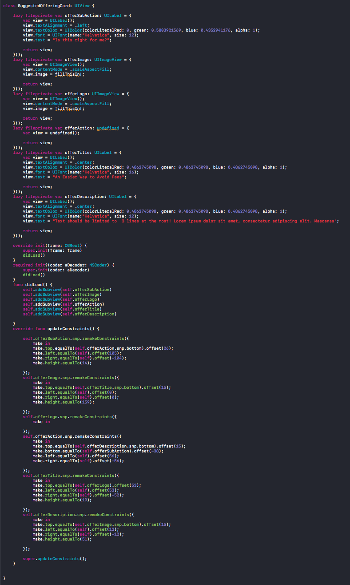

#SWARM View Generator
###Sketch plugin that generates iOS view code from symbols


##Generate this



##From this
 


TOC
==
* [How to set up your sketch file/ What to expect](#how-to-set-up-your-sketch-file/-What-to-expect)
* [How to generate the code](#how-to-generate-code)
* [How it works](#how-it-works)
* [How to modify it](#how-to-modify-it)
* [Ideas for the Future](#ideas-for-the-future)


How to set up your sketch file/ What to expect
--------------
###Use Symbols
* The plugin works by turning individual symbols into subclassed UIViews.
* It will loop through the sub elements of a symbol and add them to the symbol's view, style the subviews, and generate constraints.
* **Keep symbols simple, one layer of depth**, if a symbol is becoming complex, you can probably split it up into multiple symbols and multiple views.

###Text Areas 
* Any piece of text in your design will be output as a UILabel. After exporting you can always change it to whatever you want in XCode
* Sometimes font names can get funky, you may need to manually update what is exported.


###Images
* Anything that is set to exportable will be treated as an image.
* You will need to import the actual UIImage and set it manually.


###Sub Symbols
* If there is a symbol inside of the symbol you are exporting it is treated as if it is of a custom UIView subclass.


###Groups
* Groups are treated as an "undefined" class type, unless they are set to exportable (they will then be an image). They will be added into the view hierarchy and constraints will be created, but you will have to manually update the initialization code.

###Everything else is ignored
* For now, everything else is ignored. If you want it to be exported make it exportable so it is treated as an image or pull this repo and help us add use cases!

###Snapkit
* We are using [SnapKit](https://github.com/SnapKit/SnapKit) to set up constraints, you will need to include it within your project. 

###Expectations
* This plugin is not meant to generate the end all be all of the views within your app. It is meant to generate a starting point, the scaffolding for creating your views. Reducing the need to write a ton of boiler plate code every project.

How to generate code
----------
###Set Constraints
* There are two commands inside of this plugin. Before generating the code you should set up the constraints so that the script can make educated guesses about how to set up the autolayout code. 
	* You have to select each individual subview and set up constraints for that view. 
	* After setting up constraints, the plugin will figure out the offset/padding by itself.
	* **Example**: You want a view to fix the top of itself to the bottom of a sibling, you would select the sibling under Snap Top to view: and then check "Snap to view's bottom."
	* **Example 2**: You want a view to fix the top of itself to the top of the superview. You would select superview from Snap Top to view: and leave "Snap to view's bottom." unchecked.
	* "Fix Element's Height" and "Fix Element's Width" use the pixel values defined in Sketch to set the element's size.
	* "set width to view's width:" and "set height to view's height:" will set the element's width/height to match whatever the corresponding view's width/height is.
* **If you don't set up constraints, it will still generate view code, but the constraint definitions will be blank**
* After constraints are set on every element, select the symbol and run "Generate View Code." **The view code will be copied to your clipboard and you can paste it into XCode**


How it works
----------
* The plugin looks at the symbol and generates an object that holds the symbol and all of it's subelements. 
* It will use the constraints set in "Save Constraints For Layer" to create a collection of constraints it should apply and add them to the object.
* It will read styles for each element and add them to the object as well.
* It then takes that object and construct view code from it. 

How to modify it
------
####Some tips on debugging sketch plugins
* You can recieve logs in the console app under Reports>system.log
* Sketch normally caches plugins and only updates them on restart. You can run this command and set Sketch to reload the plugin everytime it is run:
```
defaults write ~/Library/Preferences/com.bohemiancoding.sketch3.plist AlwaysReloadScript -bool YES
```
* You can get to the plugin directory quickly inside of sketch by going to Plugins > Manage Plugins... > Settings Icon > Show Plugins Folder

Ideas for the Future
------
* Look into generating constraints automatically, removing the need to specify them
* Split out padding/offsets into a constants files to be reused throughout the app
* Connect plugin to XCode project for auto insertion of view code.
* Auto updating files within XCode if the app's design changes mid development
* Adding support for Android and the Web
* Look through the file and autogenerating code for every symbol or specified symbols rather than exporting one by one.
